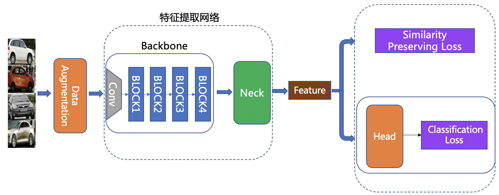

# 特征提取
## 1. 简介
特征提取是图像识别中的关键一环，它的作用是将输入的图片转化为固定维度的特征向量，用于后续的[向量检索](./vector_search.md)。好的特征需要具备相似度保持性，即在特征空间中，相似度高的图片对其特征相似度要比较高（距离比较近），相似度低的图片对，其特征相似度要比较小（距离比较远）。[Deep Metric Learning](../algorithm_introduction/metric_learning.md)用以研究如何通过深度学习的方法获得具有强表征能力的特征。

## 2. 网络结构
为了图像识别任务的灵活定制，我们将整个网络分为Backbone、 Neck、 Head以及Loss部分，整体结构如下图所示:

图中各个模块的功能为:
- **Backbone**:   指定所使用的骨干网络。 值得注意的是，PaddleClas提供的基于ImageNet的预训练模型，最后一层的输出为1000， 我们需要依据所需的特征维度定制最后一层的输出。
- **Neck**:  用以特征增强及特征维度变换。  这儿的Neck，可以是一个简单的Linear Layer，用来做特征维度变换；也可以是较复杂的FPN结构，用以做特征增强。
- **Head**:  用来将feature转化为logits。 除了常用的Fc Layer外，还可以替换为cosmargin, arcmargin, circlemargin等模块。
- **Loss**:  指定所使用的Loss函数。  我们将Loss设计为组合loss的形式， 可以方便得将Classification Loss和Pair_wise Loss组合在一起。

## 3. 通用识别模型
在PP-Shitu中, 我们采用[PP_LCNet_x2_5](../models/PP-LCNet.md)作为骨干网络， Neck部分选用Linear Layer， Head部分选用[ArcMargin](https://arxiv.org/abs/1801.07698)， Loss部分选用CELoss，详细的配置文件见[通用商品识别配置文件](../../../ppcls/configs/GeneralRecognition/GeneralRecognition_PPLCNet_x2_5.yaml)。其中，训练数据为如下7个公开数据集的汇总：
| 数据集       | 数据量   | 类别数   | 场景  | 数据集地址 |
| :------------:  | :-------------: | :-------: | :-------: | :--------: |
| Aliproduct | 2498771 | 50030 | 商品 | [地址](https://www.objects365.org/overview.html) |
| GLDv2 | 1580470 | 81313  | 地标 | [地址](https://cocodataset.org/) |
| VeRI-Wild | 277797 | 30671 | 车辆 | [地址](https://github.com/luxiangju-PersonAI/iCartoonFace) |
| LogoDet-3K | 155427 | 3000 | Logo | [地址](https://github.com/Wangjing1551/LogoDet-3K-Dataset) |
| iCartoonFace | 389678 | 5013  | 动漫人物 | [地址](https://rpc-dataset.github.io/) |
| SOP | 59551 | 11318  | 商品 | [地址](https://rpc-dataset.github.io/) |
| Inshop | 25882 | 3997  | 商品 | [地址](https://rpc-dataset.github.io/) |
| **Total** | **5M** | **185K**  | ---- | [地址](https://rpc-dataset.github.io/) |

最终的模型效果如下表所示:
| 模型       | Aliproduct  | VeRI-Wild  |  LogoDet-3K |  iCartoonFace | SOP | Inshop | Latency(ms) |
| :----------:  | :---------: | :-------: | :-------: | :--------: | :--------: | :--------: | :--------: |
PP-LCNet-2.5x | 0.839 | 0.888 | 0.861 | 0.841 | 0.793 | 0.892 | 5.0
* 采用的评测指标为`Recall@1`
* 速度评测机器的CPU具体信息为：`Intel(R) Xeon(R) Gold 6148 CPU @ 2.40GHz`，速度指标为开启 mkldnn ，线程数设置为 10 测试得到。

# 4. 自定义特征提取
自定义特征提取，是指依据自己的任务，重新训练特征提取模型。主要包含如下四个步骤：1）数据准备；2）模型训练；3）模型评估；4）模型推理。
## 4.1 数据准备
首先，需要基于任务的需要，定制自己的数据集。数据的制作方法，参见

## 4.2 模型训练
- 单机单卡训练
```shell
export CUDA_VISIBLE_DEVICES=0
python tools/train.py -c ppcls/configs/GeneralRecognition/GeneralRecognition_PPLCNet_x2_5.yaml
```
- 单机多卡训练
```shell
export CUDA_VISIBLE_DEVICES=0,1,2,3
python -m paddle.distributed.launch 
    --gpus="0,1,2,3" tools/train.py
    -c ppcls/configs/GeneralRecognition/GeneralRecognition_PPLCNet_x2_5.yaml
```
注意: 配置文件中默认采用`在线评估`的方式，如果你想加快训练速度，去除`在线评估`，只需要在上述命令后面，增加`-o eval_during_train=False`。
训练完毕后，在output目录下会生成最终模型文件`latest.pd*`，`best_model.pd*`和训练日志文件`train.log`。

## 4.3 模型评估
- 单卡评估
```shell
export CUDA_VISIBLE_DEVICES=0
python tools/eval.py -c ppcls/configs/GeneralRecognition/GeneralRecognition_PPLCNet_x2_5.yaml \
\ -o Global.pretrained_model="output/RecModel/best_model"
```

- 多卡评估
```shell
export CUDA_VISIBLE_DEVICES=0,1,2,3
python -m paddle.distributed.launch 
    --gpus="0,1,2,3" tools/eval.py
    -c  ppcls/configs/GeneralRecognition/GeneralRecognition_PPLCNet_x2_5.yaml
    -o  Global.pretrained_model="output/RecModel/best_model"
```
**推荐：** 使用多卡评估，可以利用多卡快速计算得到整体数据集的特征集合，能够加速评估的过程。

## 4.4 模型推理
推理过程包括两个步骤： 1)导出推理模型, 2)获取特征向量
### 4.4.1 导出推理模型
```
python tools/export_model -c ppcls/configs/ResNet50_vd_SOP.yaml -o Global.pretrained_model="output/RecModel/best_model"
```
生成的推理模型位于`inference`目录，名字为`inference.pd*`

### 4.4.2 获取特征向量
```
cd deploy
python python/predict_rec.py -c configs/inference_rec.yaml -o Global.rec_inference_model_dir="../inference"
```
