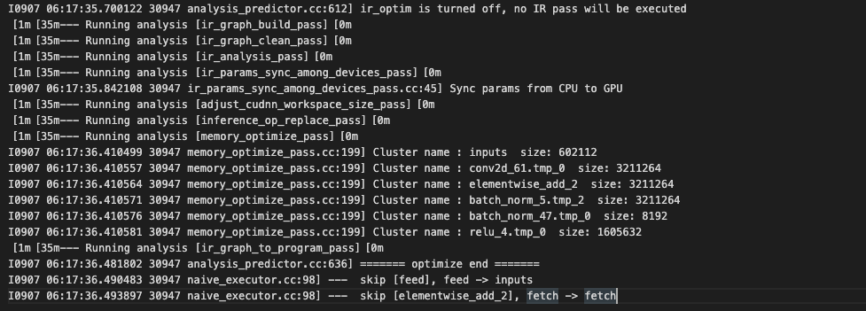

# 模型服务化部署
- [简介](#简介)
- [Serving安装](#Serving安装)
- [图像分类服务部署](#图像分类服务部署)
- [图像识别服务部署](#图像识别服务部署)
- [FAQ](#FAQ)

<a name="简介"></a>
## 1. 简介
[Paddle Serving](https://github.com/PaddlePaddle/Serving) 旨在帮助深度学习开发者轻松部署在线预测服务，支持一键部署工业级的服务能力、客户端和服务端之间高并发和高效通信、并支持多种编程语言开发客户端。

该部分以 HTTP 预测服务部署为例，介绍怎样在 PaddleClas 中使用 PaddleServing 部署模型服务。

<a name="Serving安装"></a>
## 2. Serving安装

Serving 官网推荐使用 docker 安装并部署 Serving 环境。首先需要拉取 docker 环境并创建基于 Serving 的 docker。

```shell
nvidia-docker pull hub.baidubce.com/paddlepaddle/serving:0.2.0-gpu
nvidia-docker run -p 9292:9292 --name test -dit hub.baidubce.com/paddlepaddle/serving:0.2.0-gpu
nvidia-docker exec -it test bash
```

进入 docker 后，需要安装 Serving 相关的 python 包。

```shell
pip install paddlepaddle-gpu
pip install paddle-serving-client
pip install paddle-serving-server-gpu
pip install paddle-serving-app
```

* 如果安装速度太慢，可以通过 `-i https://pypi.tuna.tsinghua.edu.cn/simple` 更换源，加速安装过程。

* 如果希望部署 CPU 服务，可以安装 serving-server 的 cpu 版本，安装命令如下。

```shell
pip install paddle-serving-server
```
<a name="图像分类服务部署"></a>
## 3. 图像分类服务部署
### 3.1 模型转换
使用PaddleServing做服务化部署时，需要将保存的inference模型转换为Serving模型。下面以经典的ResNet50_vd模型为例，介绍如何部署图像分类服务。
- 进入工作目录：
```shell
cd deploy/paddleserving
```
- 下载ResNet50_vd的inference模型：
```shell
# 下载并解压ResNet50_vd模型
wget https://paddle-imagenet-models-name.bj.bcebos.com/dygraph/inference/ResNet50_vd_infer.tar && tar xf ResNet50_vd_infer.tar
```
- 用paddle_serving_client把下载的inference模型转换成易于Server部署的模型格式：
```
# 转换ResNet50_vd模型
python3 -m paddle_serving_client.convert --dirname ./ResNet50_vd_infer/ \
                                         --model_filename inference.pdmodel  \
                                         --params_filename inference.pdiparams \
                                         --serving_server ./ResNet50_vd_serving/ \
                                         --serving_client ./ResNet50_vd_client/
```
ResNet50_vd推理模型转换完成后，会在当前文件夹多出`ResNet50_vd_serving` 和`ResNet50_vd_client`的文件夹，具备如下格式：
```
|- ResNet50_vd_client/
  |- __model__  
  |- __params__
  |- serving_server_conf.prototxt  
  |- serving_server_conf.stream.prototxt
|- ResNet50_vd_client
  |- serving_client_conf.prototxt  
  |- serving_client_conf.stream.prototxt
```
得到模型文件之后，需要修改serving_server_conf.prototxt中的alias名字： 将`feed_var`中的`alias_name`改为`image`, 将`fetch_var`中的`alias_name`改为`prediction`

**备注**:  Serving为了兼容不同模型的部署，提供了输入输出重命名的功能。这样，不同的模型在推理部署时，只需要修改配置文件的alias_name即可，无需修改代码即可完成推理部署。
修改后的serving_server_conf.prototxt如下所示:
```
feed_var {
  name: "inputs"
  alias_name: "image"
  is_lod_tensor: false
  feed_type: 1
  shape: 3
  shape: 224
  shape: 224
}
fetch_var {
  name: "save_infer_model/scale_0.tmp_1"
  alias_name: "prediction"
  is_lod_tensor: true
  fetch_type: 1
  shape: -1
}
```
### 3.2 服务部署和请求
paddleserving目录包含了启动pipeline服务和发送预测请求的代码，包括：
```shell
__init__.py
config.yml                 # 启动服务的配置文件
pipeline_http_client.py    # http方式发送pipeline预测请求的脚本
pipeline_rpc_client.py     # rpc方式发送pipeline预测请求的脚本
classification_web_service.py    # 启动pipeline服务端的脚本
```

- 启动服务：
```shell
# 启动服务，运行日志保存在log.txt
python3 classification_web_service.py &>log.txt &
```
成功启动服务后，log.txt中会打印类似如下日志


- 发送请求：
```shell
# 发送服务请求
python3 pipeline_http_client.py
```
成功运行后，模型预测的结果会打印在cmd窗口中，结果示例为：


<a name="图像识别服务部署"></a>
## 4.图像识别服务部署
使用PaddleServing做服务化部署时，需要将保存的inference模型转换为serving易于部署的模型。 下面以PP-ShiTu中的超轻量商品识别模型为例，介绍图像识别服务的部署。
## 4.1 模型转换
- 下载通用检测inference模型和商品识别inference模型
```
cd deploy
# 下载并解压商品识别模型
wget -P models/ https://paddle-imagenet-models-name.bj.bcebos.com/dygraph/rec/models/inference/general_PPLCNet_x2_5_lite_v1.0_infer.tar
cd models
tar -xf general_PPLCNet_x2_5_lite_v1.0_infer.tar
# 下载并解压通用检测模型
wget https://paddle-imagenet-models-name.bj.bcebos.com/dygraph/rec/models/inference/picodet_PPLCNet_x2_5_mainbody_lite_v1.0_infer.tar
tar -xf picodet_PPLCNet_x2_5_mainbody_lite_v1.0_infer.tar
```
- 转换商品识别inference模型为易于server部署的模型格式：
```
# 转换商品识别模型
python3 -m paddle_serving_client.convert --dirname ./general_PPLCNet_x2_5_lite_v1.0_infer/ \
                                         --model_filename inference.pdmodel  \
                                         --params_filename inference.pdiparams \
                                         --serving_server ./general_PPLCNet_x2_5_lite_v1.0_serving/ \
                                         --serving_client ./general_PPLCNet_x2_5_lite_v1.0_client/
```
商品识别推理模型转换完成后，会在当前文件夹多出`general_PPLCNet_x2_5_lite_v1.0_serving/` 和`general_PPLCNet_x2_5_lite_v1.0_serving/`的文件夹。修改serving_server_conf.prototxt中的alias名字： 将`fetch_var`中的`alias_name`改为`features`。
修改后的serving_server_conf.prototxt内容如下：
```
feed_var {
  name: "x"
  alias_name: "x"
  is_lod_tensor: false
  feed_type: 1
  shape: 3
  shape: 224
  shape: 224
}
fetch_var {
  name: "save_infer_model/scale_0.tmp_1"
  alias_name: "features"
  is_lod_tensor: true
  fetch_type: 1
  shape: -1
}
```
- 转换通用检测inference模型为易于server部署的模型格式：
```
# 转换通用检测模型
python3 -m paddle_serving_client.convert --dirname ./picodet_PPLCNet_x2_5_mainbody_lite_v1.0_infer/ \
                                         --model_filename inference.pdmodel  \
                                         --params_filename inference.pdiparams \
                                         --serving_server ./picodet_PPLCNet_x2_5_mainbody_lite_v1.0_serving/ \
                                         --serving_client ./picodet_PPLCNet_x2_5_mainbody_lite_v1.0_client/
```
通用检测inference模型转换完成后，会在当前文件夹多出`picodet_PPLCNet_x2_5_mainbody_lite_v1.0_serving/` 和`picodet_PPLCNet_x2_5_mainbody_lite_v1.0_client/`的文件夹。

- 下载并解压已经构建后的商品库index
```
cd ../
wget https://paddle-imagenet-models-name.bj.bcebos.com/dygraph/rec/data/drink_dataset_v1.0.tar && tar -xf drink_dataset_v1.0.tar
```

## 4.2 服务部署和请求
**注意:**  识别服务涉及到多个模型，采用PipeLine部署方式。Pipeline部署方式当前不支持windows平台。
- 进入到工作目录
```shell
cd ./deploy/paddleserving/recognition
```
paddleserving目录包含启动pipeline服务和发送预测请求的代码，包括：
```
__init__.py
config.yml                    # 启动服务的配置文件
pipeline_http_client.py       # http方式发送pipeline预测请求的脚本
pipeline_rpc_client.py        # rpc方式发送pipeline预测请求的脚本
recognition_web_service.py    # 启动pipeline服务端的脚本
```
- 启动服务：
```
# 启动服务，运行日志保存在log.txt
python3 recognition_web_service.py &>log.txt &
```
成功启动服务后，log.txt中会打印类似如下日志


- 发送请求：
```
python3 pipeline_http_client.py
```
成功运行后，模型预测的结果会打印在cmd窗口中，结果示例为：


<a name="FAQ"></a>
## 5.FAQ
**Q1**： 发送请求后没有结果返回或者提示输出解码报错

**A1**： 启动服务和发送请求时不要设置代理，可以在启动服务前和发送请求前关闭代理，关闭代理的命令是：
```
unset https_proxy
unset http_proxy
```

更多的服务部署类型，如 `RPC预测服务` 等，可以参考 Serving 的 github 官网：[https://github.com/PaddlePaddle/Serving/tree/develop/python/examples/imagenet](https://github.com/PaddlePaddle/Serving/tree/develop/python/examples/imagenet)
