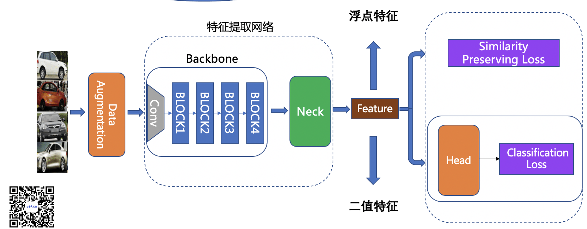

# 特征提取

特征提取是图像识别中的关键一环，它的作用是将输入的图片转化为固定维度的特征向量，用于后续的[向量检索](./vector_search.md)。好的特征需要具备相似度保持性，即在特征空间中，相似度高的图片对其特征相似度要比较高（距离比较近）；相似度低的图片，其特征相似度要比较小（距离比较远）。

本文主要介绍如何使用PaddleClas构建一个特征学习网络， 如何训练、评估、推理。

# 网络结构


为了图像识别任务的灵活定制，我们将整个网络分为Backbone, Neck, Head以及Loss部分，整体结构如上图所示，下面分别介绍各自的功能:
- Backbone:   指定所使用的骨干网络。值得注意的是，PaddleClas提供的基于ImageNet的预训练模型，最后一层的输出为1000， 我们需要依据所需的特征维度定制最后一层的输出。
- Neck:  用以特征增强及特征维度变换；  这儿的Neck，可以是一个简单的Linear Layer，用来做特征维度变换；也可以是较复杂的FPN结构，用以做特征增强。
- Head:  用来将feature转化为logits; 除了常用的Fc Layer外，我们还提供了cosmargin, arcmargin, circlemargin模块
- Loss:  指定所所用的Loss函数； Loss是特征提取能力的关键， Deep Metric Learing和Deep Hash很多的研究工作都聚焦在loss设计上。 我们将Loss设计为组合loss的形式， 可以方便得将Classification Loss和Similarity Preserving Loss组合在一起


# 配置文件介绍
下面以商品识别模型为例，介绍配置文件的含义：
## 网络结构
```
Arch:
  name: RecModel
  infer_output_key: features
  infer_add_softmax: False

  Backbone: 
    name: PPLCNet_x2_5
    pretrained: True
    use_ssld: True
  BackboneStopLayer:
    name: flatten_0
  Neck:
    name: FC
    embedding_size: 1280
    class_num: 512
  Head:
    name: ArcMargin 
    embedding_size: 512
    class_num: 185341
    margin: 0.2
    scale: 30
```
- **name**: 模型的名字，有别于PaddleClas提供的标准分类模型，定制化的识别模型，统一命名为RecModel
- **infer_output_key**: 推理时需要用到的Tensor的key, 训练模型下，网络会以字典的形式输出features和logits. 识别任务中，推理时只需要用到features即可
- **infer_output_key**： 推理时是否需要加softmax。为了和分类任务的统一，分类任务推理时需要加softmax操作，识别任务不需要
- **Backbone**:  骨干网络， 此处选用的是经过SSLD蒸馏之后的预训练模型
- **BackboneStopLayer**:  该处用以指示在哪儿截断
- **Neck**:  输出512维的特征向量
- **Head**:  采用ArcMargin, 此处可以依据训练数据修改类别数class_num,  以及超参数margin和scale

## Loss构成
### 单Loss示例
```
Loss:
  Train:
    - CELoss:
        weight: 1.0
  Eval:
    - CELoss:
        weight: 1.0
```
可以看到此处选用的是CELoss， 结合Head部分的ArcMargin, 因此使用的是ArcFace中的算法

### 组合Loss示例
```
Loss:
  Train:
    - CELoss:
        weight: 1.0
    - TripletLossV2:
        weight: 1.0
        margin: 0.5
  Eval:
    - CELoss:
        weight: 1.0
```
可以看到此处选用的是CELoss和TripletLoss的一个组合，两者的比例为1：1.

# 训练
下面以`ppcls/configs/Products/ResNet50_vd_SOP.yaml`为例，介绍模型的训练、评估、推理过程
## 单机单卡训练
```
python tools/train.py -c ppcls/configs/ResNet50_vd_SOP.yaml
```

## 单机多卡训练
```
python -m paddle.distributed.launch 
    --gpus="0,1,2,3" tools/train.py 
    -c ppcls/configs/ResNet50_vd_SOP.yaml
```
训练完成之后，会在`output`目录下生成`best_model`


# 评估
## 1. 设置合适的评估方式
评估方式在配置文件的Metric字段设置， 包含了Train和Eval字段，Train评估考虑到耗时较长可以选择忽略，即训练时不对训练数据评估。一般检索任务的评估方式可以选用Recal@k, Precision@k和mAP. 示例配置如下所示：
```
Metric:
  Eval:
    - Recallk:
        topk: [1, 5]
```

## 2. 单卡评估
```
python tools/eval.py -c ppcls/configs/ResNet50_vd_SOP.yaml -o Global.pretrained_model = "output/ReModel/best_model"
```

## 3. 多卡评估
```
python -m paddle.distributed.launch 
    --gpus="0,1,2,3" tools/eval.py 
    -c  ppcls/configs/ResNet50_vd_SOP.yaml
    -o  Global.pretrained_model="output/ReModel/best_model"
```

# 推理
推理过程包括两个步骤： 1） 导出推理模型；  2） 获取特征向量
## 1. 导出推理模型
```
python tools/export_model -c xxx -o Global.pretrained_model = xxxx
```
生成的推理模型位于inference目录，名字为inference.pd*

## 2. 获取特征向量
```
cd deploy
python python/inference_rec.py -c configs/   O rec_inference_model_dir: "../inference/inference"
```


